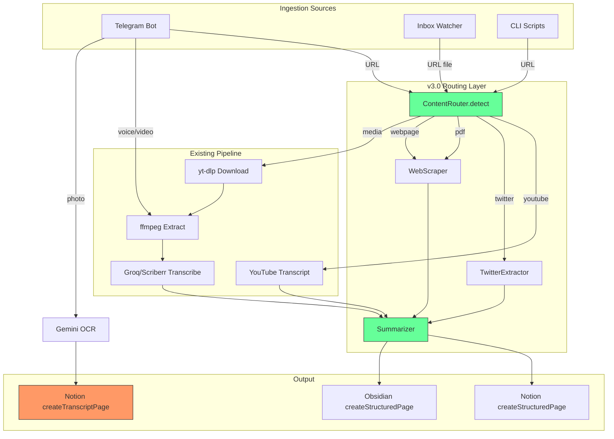

# Voice-to-Notion v3.0 Code Review

## Executive Summary

The v3.0 update adds a **multi-format content capture pipeline** (articles, tweets, PDFs, markdown) with LLM auto-summarization on top of the existing audio/video transcription system. The new modules -- `content-router.js`, `summarizer.js`, `web-scraper.js`, `twitter-extractor.js` -- are clean, focused, and well-integrated. The `createStructuredPage()` method on both Notion and Obsidian clients provides a consistent Summary + Full Transcript page format.

**The good:** Solid architecture, clear separation of concerns, defensive error handling with graceful fallbacks throughout the pipeline. The content router is deterministic (regex, no LLM), the summarizer properly constrains output via JSON schema, and the web scraper has sensible fallback extraction.

**Critical issues found:**

1. **Telegram `handleText` calls `ingestUrl()` but the CLI `ingest-url.js` still calls the old `ingest()`** -- direct CLI users get no summarization, no content routing, no structured pages for non-media URLs.
2. **`ingest()` (the old path) still calls `createTranscriptPage()` instead of `createStructuredPage()`** -- YouTube URLs processed through `ingest()` get the legacy flat page format, not the new structured one. This creates an inconsistent user experience depending on entry point.
3. **`ingestUrl()` catch block falls back to `ingest()` on any error**, which means a transient Groq API failure during summarization causes the entire extraction to be discarded and re-done via yt-dlp -- wasting time and producing a worse result.
4. **Memory: PDF buffer loaded entirely into RAM** in both `web-scraper.js` (50MB limit) and `telegram-bot.js` (fs.readFileSync). No streaming.
5. **Version mismatch:** `index.js` banner says "v2.1" but `package.json` says "3.0.0".
6. **No tests for any of the v3.0 modules** -- `summarizer.js`, `content-router.js`, `web-scraper.js`, `twitter-extractor.js` have zero test coverage.

**Severity assessment:** Issues 1-3 are functional bugs that affect user experience. Issues 4-5 are operational concerns. Issue 6 is a test coverage gap.

---

## Table of Contents

1. [Architecture Analysis](#1-architecture-analysis)
2. [Media Pipeline (media-pipeline.js)](#2-media-pipeline)
3. [Content Router (content-router.js)](#3-content-router)
4. [Summarizer (summarizer.js)](#4-summarizer)
5. [Web Scraper (web-scraper.js)](#5-web-scraper)
6. [Twitter Extractor (twitter-extractor.js)](#6-twitter-extractor)
7. [Telegram Bot (telegram-bot.js)](#7-telegram-bot)
8. [Notion Client (notion.js)](#8-notion-client)
9. [Obsidian Client (obsidian.js)](#9-obsidian-client)
10. [Audio Extractor (audio-extractor.js)](#10-audio-extractor)
11. [Entry Point and Configuration (index.js)](#11-entry-point)
12. [Security Concerns](#12-security)
13. [Missing Tests](#13-tests)
14. [Comprehensive Summary](#14-summary)

---

## 1. Architecture Analysis

### Overall Structure

The system is well-factored into three ingestion sources (Scriberr sync, inbox watcher, Telegram bot) that converge on two output clients (Notion, Obsidian). The v3.0 additions slot in cleanly:



### The Dual-Path Problem

The most significant architectural issue is that two parallel ingestion paths exist:

| Method | Called by | Content routing | Summarization | Output format |
|--------|----------|----------------|---------------|---------------|
| `ingestUrl()` | Telegram bot `handleText` | Yes (ContentRouter) | Yes (Summarizer) | `createStructuredPage()` |
| `ingest()` | CLI `ingest-url.js`, inbox watcher, `ingestUrl()` fallback | No | No | `createTranscriptPage()` |

This means the same YouTube URL produces different Notion page structures depending on whether it was sent via Telegram or via the CLI. The inbox watcher's `processFile()` method (line 152-178 of `media-pipeline.js`) calls `ingest()` for URL files, not `ingestUrl()`.

**Recommendation:** Replace `ingest()` calls in `processFile()` and `ingest-url.js` with `ingestUrl()`, making the smart routing the default path. Keep `ingest()` as an internal method for the yt-dlp-specific fallback.

---

## 2. Media Pipeline (media-pipeline.js)

### ingestUrl() - The New Entry Point

[media-pipeline.js](../src/media-pipeline.js) (Lines 511-595)

**Good:**
- Clean switch/case routing based on `ContentRouter.detect()`
- Falls back to `ingest()` when extraction fails (line 553) -- sensible degradation
- Falls back to `ingest()` in the catch block (line 593) -- last-resort safety net

**Issues:**

1. **Double fallback on error (line 590-594):** If `createStructuredPage()` throws (e.g., Notion API 400), the catch block calls `ingest()` which will attempt to download and re-process the URL via yt-dlp, then call `createTranscriptPage()`. For a webpage URL, yt-dlp will fail too, and the user gets a cryptic error instead of the original Notion API error.

```javascript
// Line 590-594: catch block falls back to ingest() on ANY error
} catch (error) {
  console.error(`[MediaPipeline] Smart ingest failed: ${error.message}`);
  // Last resort: try standard ingest
  return this.ingest(url, opts);
}
```

**Recommendation:** Only fall back to `ingest()` for extraction failures, not for downstream errors (Notion/Obsidian API failures). Rethrow if the error came from `createStructuredPage()`.

2. **Missing `isAudio` variable in `ingestFile()` scope (line 364):** The `isAudio` variable is declared with `const` inside a block but referenced correctly via closure. This works but the variable name shadows no outer binding -- no actual bug here, just noting the flow.

### ingest() - The Legacy Path

[media-pipeline.js](../src/media-pipeline.js) (Lines 190-282)

3. **`audioPath` reassignment on line 242 overrides line 221:**

```javascript
// Line 221: audioPath set during transcription path
audioPath = downloadResult.filePath;

// Line 242: audioPath unconditionally reassigned before upload
audioPath = audioResult?.filePath || downloadResult.filePath;
```

This is correct behavior (the second assignment picks the extracted audio if it exists), but the variable is used for two different purposes in the same scope. The first assignment (line 221) is only relevant inside the `if (!transcript)` block. This is not a bug but makes the flow harder to reason about.

4. **No summarization in `ingest()`:** The old path produces flat transcript pages. If the user has Groq configured, they get titles but not summaries or key points. This is the primary UX inconsistency.

### ingestYouTubeWithSummary()

[media-pipeline.js](../src/media-pipeline.js) (Lines 600-690)

5. **Download failure silently continues (line 619-621):** If `downloader.download()` fails, the code continues with `downloadResult = null`, which means no audio attachment and potentially no transcript (if subtitles were unavailable). The user gets a page with "[Transcript not available]" and no indication of what went wrong.

6. **Cleanup only handles downloadResult, not audioPath (line 687):** If audio extraction produced a separate file, it would leak. In practice, YouTube downloads are audio-only so `audioPath` always equals `downloadResult.filePath`, but the cleanup is asymmetric compared to `ingest()`.

### ingestFile()

[media-pipeline.js](../src/media-pipeline.js) (Lines 293-398)

7. **Title overwritten by summarizer (line 366):** If the summarizer returns a title, it replaces the Groq-generated title from line 344. This is intentional (summarizer > Groq title generator) but means the title generation on line 341-348 is wasted work when the summarizer is available. Minor efficiency concern.

### getSourceCategory() - Orphaned JSDoc

[media-pipeline.js](../src/media-pipeline.js) (Lines 448-466)

8. **Orphaned JSDoc comment block (lines 448-451):** There is a JSDoc comment for `getSourceCategory` that appears before `formatLocation()`, with `getSourceCategory()` defined after `formatLocation()`. The JSDoc block at line 448 starts with `/** Determine Notion source category */` but the function it describes is at line 461. This is a cosmetic issue but suggests copy-paste error during refactoring.

---

## 3. Content Router (content-router.js)

[content-router.js](../src/content-router.js) (Lines 1-83)

**Good:**
- Pure static methods, no state, no side effects -- easy to test and reason about
- Regex-based detection is fast and deterministic
- `isMediaUrl()` properly separates media detection from content-type detection

**Issues:**

9. **YouTube Shorts URL edge case:** The regex `(?:youtube\.com\/(?:watch\?v=|shorts\/|embed\/)|youtu\.be\/)` correctly handles shorts, but `isMediaUrl()` only checks `youtube\.com|youtu\.be` -- a YouTube Shorts URL would be classified as media by `isMediaUrl()` even though it is already handled by `detect()`. This is fine because the `ingestUrl()` method checks `detect()` first and routes to `ingestYouTubeWithSummary()`, but the `isMediaUrl()` check on line 523 is redundant for YouTube URLs.

10. **LinkedIn/Perplexity route to `webpage` extractor:** Both `perplexity` and `linkedin` types fall through to `webScraper.extract()`. LinkedIn pages are heavily JavaScript-rendered and Readability-based extraction will likely return garbage or login walls. This should be documented as a known limitation, or LinkedIn URLs should fall back to yt-dlp (which can sometimes extract LinkedIn video content).

11. **PDF detection by extension only:** The regex `\.pdf(\?|#|$)` misses PDFs served at URLs without `.pdf` extension (e.g., academic paper portals that serve PDFs from `/download/12345`). The `web-scraper.js` `extractPdf()` method does check Content-Type headers, but it never gets called unless the URL matches the extension pattern.

12. **`toNotionType()` maps `pdf` and `perplexity` to `'Idea'`:** This seems like a placeholder. PDFs (especially academic papers) are not "ideas" -- a more descriptive type like "Document" or "Paper" would be more useful for filtering in Notion.

---

## 4. Summarizer (summarizer.js)

[summarizer.js](../src/summarizer.js) (Lines 1-122)

**Good:**
- Content-type-aware prompting with well-crafted instructions per type
- JSON response format enforced via `response_format: { type: 'json_object' }`
- Defensive parsing with fallbacks for missing fields
- Tag set is constrained to a small whitelist -- prevents LLM hallucination of tags

**Issues:**

13. **Truncation at 12,000 characters (line 19):** `maxInputChars` defaults to 12,000 (~3k tokens). For a 2-hour podcast transcript that could be 100k+ characters, the summarizer only sees the first ~5 minutes of content. The summary will be heavily biased toward the introduction.

**Recommendation:** Consider a chunked summarization strategy for long content -- summarize in windows, then summarize the summaries. Or at minimum, sample from beginning, middle, and end. This is a known limitation worth documenting.

14. **No retry on rate limit:** Groq's free tier has rate limits. If the summarizer hits a 429, the entire summary is silently dropped (line 68-69 returns null). The caller proceeds without a summary, which is graceful but means intermittent rate limits silently degrade output quality without any user-visible indication.

15. **`temperature: 0.2` may be too low for title generation:** Titles benefit from some creativity. The key_points and summary benefit from low temperature. Consider whether the title could use a slightly higher temperature, or accept that consistency is more important.

16. **Tag whitelist is extremely narrow:** Only 5 possible tags, all related to knowledge management/productivity. For a general-purpose capture tool, this set is too restrictive. A tweet about machine learning will get no tags at all. Consider expanding the tag vocabulary or making it configurable.

---

## 5. Web Scraper (web-scraper.js)

[web-scraper.js](../src/web-scraper.js) (Lines 1-156)

**Good:**
- Readability + jsdom is the standard approach for article extraction
- Fallback to raw body text extraction when Readability fails
- Content-Type validation for PDFs before parsing
- PDF metadata extraction (title from info, author)

**Issues:**

17. **SSRF vulnerability:** `extract()` and `extractPdf()` fetch any URL passed to them. If an attacker can control the URL (e.g., via Telegram message), they could use the server to make requests to internal network resources (`http://169.254.169.254/` for cloud metadata, `http://localhost:8080/` for Scriberr admin, etc.).

**Mitigation:** The Telegram bot has `TELEGRAM_ALLOWED_USERS` which limits who can send URLs. But if that is empty (the default), any Telegram user can trigger SSRF. At minimum, add a URL validation function that rejects private IP ranges and localhost URLs.

18. **User-Agent spoofing:** The hardcoded Chrome User-Agent string (line 17) will eventually become stale and may trigger bot detection on some sites. This is standard practice for scrapers but worth noting.

19. **PDF `require()` inside function (line 116):** `pdf-parse` is loaded via `require('pdf-parse')` inside the `extractPdf()` method rather than at module scope. This is intentional (lazy loading -- don't load pdf-parse if PDFs are never processed) but means the first PDF extraction pays a cold-start penalty. In a long-running worker, this is negligible.

20. **50MB PDF download limit:** `maxContentLength: 50 * 1024 * 1024` for PDFs downloads the entire file into an `arraybuffer` in memory. A 50MB PDF decompressed into a Buffer could be significant. For most use cases this is fine, but it is worth noting.

21. **`titleFromUrl()` silent catch (line 144-152):** If URL parsing fails, returns 'Untitled'. This is correct but swallows the error entirely -- no logging.

---

## 6. Twitter Extractor (twitter-extractor.js)

[twitter-extractor.js](../src/twitter-extractor.js) (Lines 1-100)

**Good:**
- FxTwitter API is free and requires no API key -- good choice for a self-hosted tool
- Handles quote tweets, media descriptions, engagement metrics
- Clean content assembly

**Issues:**

22. **No thread support:** The `isThread: false` on line 88 is hardcoded. FxTwitter's API does support thread/conversation fetching via different endpoints, but this implementation only gets single tweets. For Twitter threads (which are common sources of substantive content), the user only gets the first tweet.

23. **FxTwitter API reliability:** FxTwitter is a third-party service that could go down or change its API. There is no fallback. If FxTwitter is unavailable, the tweet extraction returns null and `ingestUrl()` falls back to `ingest()` which tries yt-dlp -- which will also fail for tweet URLs. The user gets an error.

**Recommendation:** Consider Nitter instances as a fallback, or at minimum, extract what you can from the URL itself (the tweet text is sometimes in the `og:description` meta tag of the Twitter page, which `web-scraper.js` could extract).

24. **Username extraction regex (line 29):** `url.match(/(?:twitter\.com|x\.com)\/(\w+)\/status/)` -- the `\w+` matches any word character, but Twitter usernames can only be `[a-zA-Z0-9_]` which is exactly what `\w` matches in JavaScript. This is correct.

---

## 7. Telegram Bot (telegram-bot.js)

[telegram-bot.js](../src/telegram-bot.js) (Lines 1-686)

**Good:**
- Reply chain implementation is clever and well-scoped (30-min TTL, cleanup timer)
- Consistent error handling pattern: edit status message with error text
- File size checks before download (respects 20MB Telegram limit)
- The `/mode` command properly swaps the client on both the bot and the pipeline

**Issues:**

25. **`handleDocument` is a 170-line method (lines 437-609):** This method handles images, markdown, PDFs, and media files with separate code paths. Each path has its own download-process-upload-track-respond pattern with duplicated error handling. This should be refactored into smaller methods.

The pattern repeats 4 times:
```javascript
const status = await ctx.reply(`Processing...`);
let tempPath = null;
try {
  tempPath = await this.downloadTelegramFile(...);
  // ... process ...
  this.trackSource(ctx.message.message_id, result.pageId);
  await ctx.telegram.editMessageText(...);
} catch (error) {
  await ctx.telegram.editMessageText(..., `Failed: ${error.message}`);
} finally {
  this.cleanup(tempPath);
}
```

This could be extracted into a `withProcessing(ctx, label, processFn)` helper that handles the status message, error reporting, and cleanup.

26. **Photo handler uses `createTranscriptPage()` not `createStructuredPage()` (line 359):** When a photo is sent directly (not as a document), the OCR result is saved via the legacy `createTranscriptPage()`. But when an image document (e.g., .jpg file) is sent, line 472 also uses `createTranscriptPage()`. Neither path gets summarization. For OCR text, summarization could be valuable (e.g., summarizing a screenshot of a long article).

27. **PDF handling duplicated between Telegram bot and web scraper:** The Telegram bot's PDF handling (lines 537-578) duplicates the `require('pdf-parse')` + buffer extraction logic from `web-scraper.js`. The bot should delegate to `this.pipeline.webScraper.extractPdf()` or a shared utility, but the web scraper expects a URL, not a local file path.

**Recommendation:** Add a `extractPdfFromFile(filePath)` method to `WebScraper` (or extract a shared utility) to avoid the duplication.

28. **`downloadTelegramFile` stream error handling (lines 636-648):** The download creates a write stream and pipes the response to it. If the HTTP response errors mid-stream, the `writer.on('error', reject)` handler catches it. But if the `response.data` stream errors, there is no explicit error handler on it. In practice, axios stream errors propagate to the pipe, but adding `response.data.on('error', reject)` would be more defensive.

29. **No timeout on Telegram file download:** The `axios` call to download the file (line 636) has no `timeout` option. For a 20MB file over a slow connection, this could hang indefinitely. The pipeline has timeouts on yt-dlp (10 min) and ffmpeg (5 min), but Telegram downloads have none.

30. **`pendingSources` Map has no size limit:** If a user sends 10,000 messages in 30 minutes, the Map grows to 10,000 entries. The 30-minute TTL cleanup runs every 5 minutes but only purges expired entries. In practice this is not a real concern for a personal bot, but for a shared bot it could be.

---

## 8. Notion Client (notion.js)

[notion.js](../src/notion.js) (Lines 1-563)

### createStructuredPage() -- The New Method

[notion.js](../src/notion.js) (Lines 492-559)

**Good:**
- Summary + Key Points + Divider + Full Transcript structure
- Tags auto-populated from LLM output with whitelist validation
- Summary property added for table view (truncated preview)
- Handles 100-block limit with overflow append

**Issues:**

31. **Dense code formatting (lines 527-553):** The `createStructuredPage()` method uses extremely compressed formatting -- single-line block constructions, no blank lines between logical sections. Compare with `createTranscriptPage()` which has clear visual separation. This makes the new method harder to read and maintain.

Example from line 542:
```javascript
for (const point of summary.keyPoints) { children.push({ object: 'block', type: 'bulleted_list_item', bulleted_list_item: { rich_text: [{ type: 'text', text: { content: point } }] } }); }
```

**Recommendation:** Expand the formatting to match the style of `createTranscriptPage()`.

32. **`Summary` property may not exist in the Notion database:** The `createStructuredPage()` method writes to a `Summary` rich_text property (line 511), but `ensureTypeOptions()` only ensures `Type` and `Source` properties exist. If the database does not have a `Summary` property, the Notion API will return a 400 validation error on the first `createStructuredPage()` call, breaking all v3.0 ingestion.

Additionally, `ensureTypeOptions()` only adds `Audio`, `Video`, and `YouTube` type options. The v3.0 `ContentRouter.toNotionType()` returns `'Post'` (for tweets/LinkedIn) and `'Idea'` (for PDFs/webpages/perplexity). Notion auto-creates new select values, so this will not error, but the new types will have no assigned color -- they will appear as grey pills in the database view.

**Recommendation:** Add `Summary` as a rich_text property and add `Post` and `Idea` to the Type select options in `ensureTypeOptions()`.

33. **Multi-part upload reads entire file into memory (line 112):**

```javascript
const fileBuffer = fs.readFileSync(filePath);
```

This is already documented in `ARCHITECTURE.md` as a known limitation. For a 500MB audio file, this allocates ~500MB of RAM. The fix is to use `fs.createReadStream()` with `start` and `end` options for each part.

---

## 9. Obsidian Client (obsidian.js)

[obsidian.js](../src/obsidian.js) (Lines 1-279)

### createStructuredPage()

[obsidian.js](../src/obsidian.js) (Lines 215-275)

**Good:**
- Mirrors Notion's structure in markdown (## Summary, ### Key Points, ## Full Transcript)
- YAML frontmatter with tags, type, source metadata
- Safe filename sanitization

**Issues:**

34. **Filename collision:** If two pages have the same title (after sanitization), the second `PUT` request overwrites the first. The Obsidian REST API's `PUT /vault/{path}` is an upsert. There is no collision check.

**Recommendation:** Append a timestamp or short hash to the filename if a file already exists at that path. Check with `GET /vault/{path}` first, or use a naming convention like `Title (2).md`.

35. **`splitText()` is duplicated identically from NotionClient:** This is already documented in `ARCHITECTURE.md`. Extract to a shared utility module (e.g., `src/utils/text.js`).

36. **`uploadFile()` is a no-op stub (line 145):** Audio and image files are silently dropped when using Obsidian. The Obsidian REST API does support writing binary files to the vault, so file attachments could be implemented by writing the file to an `attachments/` folder and embedding a markdown link (`![[attachments/file.mp3]]`).

37. **TLS certificate validation disabled (line 29):** `rejectUnauthorized: false` is necessary for the self-signed cert used by Obsidian's Local REST API, but it means the client is vulnerable to MITM attacks. Since this is a localhost-only connection, the risk is minimal. Still, consider checking if the connection is to `127.0.0.1` and only disabling verification in that case.

38. **YAML frontmatter uses `JSON.stringify()` for values (line 73):** This wraps string values in double quotes, which is valid YAML but produces frontmatter like:

```yaml
created: "2026-03-23T10:30"
type: "audio"
url: "https://example.com"
```

Most Obsidian users and YAML parsers expect unquoted strings for simple values. The quotes are harmless but look unusual.

---

## 10. Audio Extractor (audio-extractor.js)

[audio-extractor.js](../src/audio-extractor.js) (Lines 1-197)

**Good:**
- Clean ffmpeg/ffprobe wrapper with proper error handling
- Timeout on subprocess (5 min default)
- `maxBuffer` set to 5MB to prevent stdout overflow from ffprobe
- `isAudioOnly()` properly checks stream types

**Issues:**

39. **Output filename collision:** `extract()` generates the output filename from the input filename (line 49-51). If two different video files have the same name (but from different directories), the second extraction overwrites the first in the shared `outputDir`. The `MediaPipeline` creates a single shared `extracted/` directory.

In practice, this is unlikely because the temp directory is process-local and files are processed sequentially. But if concurrent processing is ever added, this will cause data corruption.

40. **`convert()` is just an alias for `extract()` (line 152-154):** The JSDoc says "semantically different" but the implementation is identical. This is fine for now but if audio-to-audio conversion ever needs different ffmpeg flags (e.g., preserving metadata, different defaults), the alias will need to diverge.

---

## 11. Entry Point and Configuration (index.js)

[index.js](../src/index.js) (Lines 1-190)

**Issues:**

41. **Version banner says "v2.1" (line 52):**

```javascript
console.log('|         Voice-to-Notion Worker v2.1                      |');
```

But `package.json` says `"version": "3.0.0"`. This should be updated.

42. **`SCRIBERR_API_URL` is required (line 19) but the media pipeline and Telegram bot do not need Scriberr:** If a user wants to use only the article/tweet capture features (v3.0 additions), they still need Scriberr credentials. The required env vars should be reconsidered for the v3.0 use case where Scriberr is optional.

43. **`unhandledRejection` handler does not exit (line 159-161):** The `uncaughtException` handler exits the process, but `unhandledRejection` only logs and continues. In Node.js 15+, unhandled rejections terminate the process by default, but this handler overrides that behavior. A dangling unhandled rejection could leave the process in a corrupt state.

44. **Graceful shutdown calls `process.exit(0)` immediately (line 144):** If any pipeline has in-flight work (e.g., a Notion API call or ffmpeg extraction), `process.exit(0)` kills it mid-operation. The `stop()` methods on each pipeline only clear the interval -- they do not wait for in-progress work to complete. A more robust approach would be to set a `shuttingDown` flag and wait for current operations to finish.

---

## 12. Security Concerns

### SSRF via URL Ingestion

**Severity: Medium-High** (if `TELEGRAM_ALLOWED_USERS` is empty)

Any URL sent to the Telegram bot or placed in `inbox_media/` is fetched by the worker. This includes:
- Internal network IPs (`http://192.168.x.x/`, `http://10.x.x.x/`)
- Cloud metadata endpoints (`http://169.254.169.254/latest/meta-data/`)
- Localhost services (`http://localhost:8080/api/v1/auth/login`)

The `WebScraper.extract()`, `WebScraper.extractPdf()`, and `TwitterExtractor.extract()` methods all make HTTP requests to user-supplied URLs.

**Mitigation:**
- Always set `TELEGRAM_ALLOWED_USERS` (the README suggests this but does not enforce it)
- Add a URL validation function that rejects RFC 1918 private addresses, link-local addresses, and localhost

### Notion API Key in Docker Environment

The Notion API key is passed as an environment variable in `docker-compose.yml`. This is visible in `docker inspect` output. For a self-hosted single-user system this is acceptable, but worth noting.

### Obsidian TLS Bypass

Already discussed in issue 37. The `rejectUnauthorized: false` is necessary for self-signed certs but disables all certificate validation.

### JSON Injection in Inbox Files

[media-pipeline.js](../src/media-pipeline.js) (Line 164): `JSON.parse(content)` on inbox `.json` files. If a malicious file is placed in the inbox, the parsed JSON controls the `url` field which is passed to `ingest()`. This is the same SSRF vector as above but through the filesystem instead of Telegram.

### Command Injection (Mitigated)

The `execFile()` usage in `audio-extractor.js`, `media-downloader.js`, and `yt-transcript.js` is the safe variant -- it does not invoke a shell, so command injection via filenames is not possible. This is correct and well-done.

---

## 13. Missing Tests

The v3.0 modules have **zero test files**:

| Module | Test File | Status |
|--------|----------|--------|
| `content-router.js` | None | **Missing** |
| `summarizer.js` | None | **Missing** |
| `web-scraper.js` | None | **Missing** |
| `twitter-extractor.js` | None | **Missing** |

All pre-v3.0 modules have corresponding test files in `test/unit/`. The v3.0 modules are pure functions or simple API wrappers that are straightforward to test:

- `ContentRouter.detect()` and `ContentRouter.isMediaUrl()` are pure static methods -- trivial to unit test with a table of URL -> expected type mappings
- `Summarizer.buildPrompt()` is a pure function -- test that correct prompts are generated per content type
- `WebScraper.titleFromUrl()` is a pure function
- `TwitterExtractor.extract()` needs a mock axios response but is otherwise straightforward

The existing test infrastructure (vitest, mock helpers) is already set up. The new modules should follow the same patterns used in the existing test files.

---

## 14. Comprehensive Summary

### What v3.0 Does Well

1. **Clean module boundaries:** Each new module (content router, summarizer, web scraper, twitter extractor) has a single responsibility and a clear API surface. No circular dependencies.

2. **Graceful degradation:** The summarizer returns null on failure (not an error). The web scraper returns null if extraction fails. The content router falls back to `webpage` for unknown URLs. The pipeline falls back to yt-dlp when smart extraction fails. Every layer has a sensible fallback.

3. **Consistent output format:** Both Notion and Obsidian get the same Summary + Key Points + Full Transcript structure. The Obsidian implementation mirrors the Notion block structure in markdown.

4. **No new external service dependencies for core functionality:** The web scraper uses only jsdom + Readability (already bundled). The twitter extractor uses a free public API. The summarizer reuses the existing Groq API key.

### What Needs Attention

**Functional Issues (bugs/inconsistencies):**
- CLI and inbox watcher bypass the v3.0 content routing and summarization entirely
- Photo OCR handler still uses legacy `createTranscriptPage()` -- no summarization
- Version banner mismatch (v2.1 vs v3.0.0)
- `Summary` Notion property not auto-created by `ensureTypeOptions()`

**Architectural Debt:**
- `handleDocument()` in the Telegram bot is a 170-line method with 4 duplicated patterns
- `splitText()` duplicated between Notion and Obsidian clients
- PDF extraction logic duplicated between web scraper and Telegram bot
- Two page creation methods (`createTranscriptPage` and `createStructuredPage`) with different capabilities

**Operational Concerns:**
- 12k character summarization truncation loses most of long transcripts
- No retry on Groq rate limits for summarization
- Multi-part Notion upload reads entire file into memory
- No timeout on Telegram file downloads

**Security:**
- SSRF possible when `TELEGRAM_ALLOWED_USERS` is unset (the default)
- Internal network URLs can be fetched via inbox .json files

**Test Coverage:**
- Zero tests for all four new modules

### Suggested Priority Order

1. Fix CLI/inbox to use `ingestUrl()` (eliminates the dual-path inconsistency)
2. Add URL validation to reject private/internal addresses
3. Write unit tests for `content-router.js` (easiest, highest value -- pure functions)
4. Fix version banner
5. Add `Summary` property to `ensureTypeOptions()`
6. Refactor `handleDocument()` to extract common processing pattern
7. Extract `splitText()` to shared utility
8. Add tests for remaining v3.0 modules
9. Improve summarization strategy for long content
10. Add timeout to Telegram file downloads
