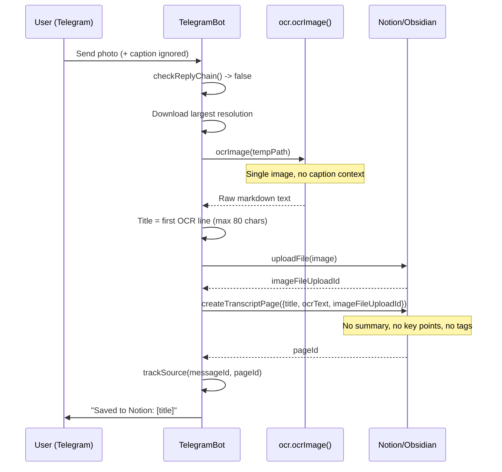
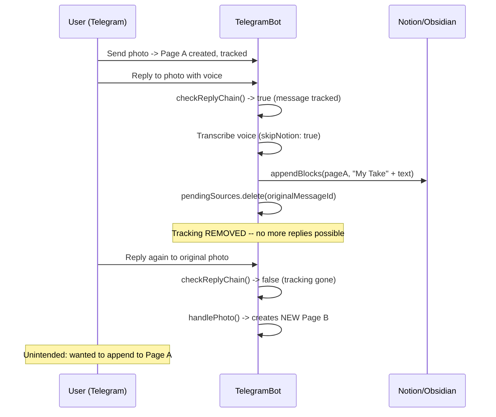
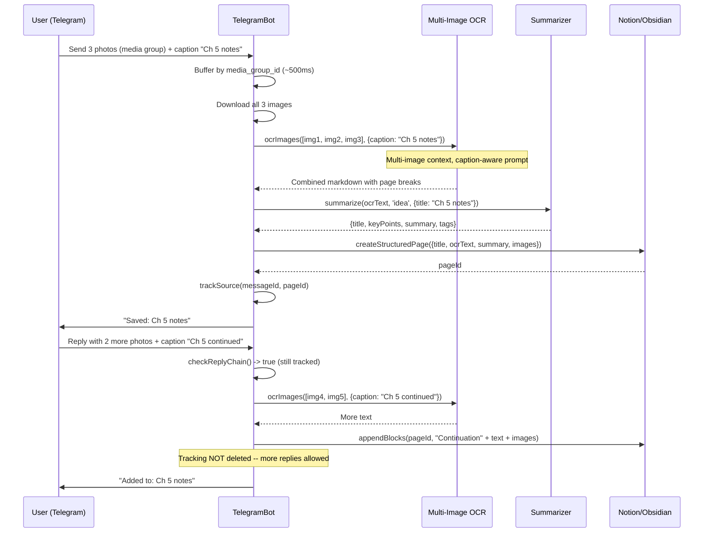

# OCR, Reply Chain, and Multi-Image Workflow Review

**Date:** 2026-03-29
**Scope:** Photo/OCR handling, reply chain mechanism, caption handling, multi-image support, and the desired notebook-photo workflow.
**Files reviewed:** `src/telegram-bot.js`, `src/ocr.js`, `src/media-pipeline.js`, `src/summarizer.js`, `src/notion.js`, `src/obsidian.js`, `src/content-router.js`, `src/index.js`

---

## Executive Summary

The voice-to-notion bot has a functional single-image OCR pipeline (Gemini 2.5 Flash) and a reply chain mechanism that can append "My Take" sections to existing Notion/Obsidian pages. However, the system has **five critical gaps** blocking the desired workflow of "send notebook photo with caption, reply with more photos, get comprehensive notes":

1. **Captions are completely ignored.** Telegram photo captions (`ctx.message.caption`) are never read. The OCR prompt receives no user context.
2. **Reply chain is single-shot.** After one reply is appended, `pendingSources` deletes the tracking entry, preventing further replies to the same message.
3. **No media group support.** Sending multiple photos in a single Telegram album (media group) creates N independent pages instead of one combined document.
4. **No multi-image OCR.** Each image is OCR'd independently with no awareness of other images in a sequence (e.g., pages 1-3 of a notebook spread).
5. **OCR output is raw extraction with no synthesis.** The Gemini prompt asks for verbatim text extraction only -- there is no summarization or structuring pass on photo-sourced content, unlike every other content type which goes through the Summarizer.

The reply chain infrastructure is well-designed and close to supporting the full workflow. Most gaps can be closed with moderate changes to `telegram-bot.js` and `ocr.js` without architectural restructuring.

---

## Detailed Analysis

### 1. Photo/OCR Handling

#### 1.1 Current `handlePhoto()` Flow

[telegram-bot.js](src/telegram-bot.js) (Lines 327-381):

```javascript
async handlePhoto(ctx) {
    // Check reply chain first
    if (await this.checkReplyChain(ctx)) return;

    const photos = ctx.message.photo;
    const largest = photos[photos.length - 1]; // highest resolution

    // ... size check ...

    const status = await ctx.reply('Processing image (OCR)...');
    let tempPath = null;

    try {
      tempPath = await this.downloadTelegramFile(ctx, largest.file_id, 'photo');
      const ocrText = await ocr.ocrImage(tempPath);

      // Use first line of OCR as title, fallback to timestamp
      const firstLine = ocrText.split('\n')[0].replace(/^#+\s*/, '').trim();
      const title = firstLine.slice(0, 80) || `Image ${new Date().toISOString()...}`;

      // Upload original image to Notion
      let imageFileUploadId = null;
      // ... upload attempt ...

      const pageId = await this.notion.createTranscriptPage({
        title,
        transcript: ocrText,
        source: 'Idea',
        imageFileUploadId,
        metadata: {},
      });

      this.trackSource(ctx.message.message_id, pageId);
      // ...
```

**What it does:**
- Selects the highest-resolution variant from Telegram's photo array (correct behavior -- Telegram sends multiple resolutions).
- Downloads to temp, runs `ocr.ocrImage()`, uses first OCR line as title.
- Uploads the original image to Notion (via FileUpload API) and embeds it in the page.
- Creates a page using `createTranscriptPage()` (the simpler, non-summary page format).
- Tracks the message for reply chain.

**What it does NOT do:**
- Read `ctx.message.caption` (Telegram's caption field for photos).
- Pass any user context to the OCR prompt.
- Run the Summarizer on the OCR output.
- Handle media groups (multiple photos sent together).

#### 1.2 OCR Module (Gemini 2.5 Flash)

[ocr.js](src/ocr.js) (Lines 1-48):

```javascript
async function ocrImage(imagePath) {
  const apiKey = process.env.GEMINI_API_KEY;
  // ...
  const model = genAI.getGenerativeModel({ model: 'gemini-2.5-flash' });

  const result = await model.generateContent([
    {
      inlineData: {
        data: imageData.toString('base64'),
        mimeType,
      },
    },
    'Extract all text from this image. Return clean markdown. Use # for headings, '
    + '- for bullets. Preserve the writer\'s exact words. Do not summarize or '
    + 'restructure. If the image contains a diagram, describe its structure briefly '
    + 'after the text.',
  ]);
  // ...
}
```

**Key observations:**

- **Single-image only.** The function signature is `ocrImage(imagePath)` -- one image path, one prompt, one response.
- **No caption parameter.** The function has no way to receive user-supplied context.
- **Prompt is extraction-only.** "Preserve the writer's exact words. Do not summarize or restructure." This is correct for raw capture, but the output never gets summarized downstream (unlike voice/URL content which goes through `Summarizer.summarize()`).
- **Gemini 2.5 Flash is multimodal-capable.** It can accept multiple images in a single `generateContent()` call, so multi-image OCR is technically straightforward with this model.

#### 1.3 Page Creation for Photos

Photos use `createTranscriptPage()` ([notion.js](src/notion.js) Lines 171-350), NOT `createStructuredPage()` ([notion.js](src/notion.js) Lines 492-559). The difference:

| Feature | `createTranscriptPage` | `createStructuredPage` |
|---------|----------------------|----------------------|
| Summary section | No | Yes (heading + key points + summary) |
| Tags from LLM | No | Yes (auto-tagged) |
| Summary property | No (raw text in body) | Yes (for table view) |
| Used by | Photos, legacy ingest | URLs, voice notes, PDFs, markdown |

This means photo-captured content lacks the structured summary, key points, and auto-tagging that every other content type receives.

---

### 2. Reply Chain Mechanism

#### 2.1 Architecture

The reply chain is built on a simple in-memory map:

[telegram-bot.js](src/telegram-bot.js) (Line 41):
```javascript
this.pendingSources = new Map();
// message_id -> { pageId, timestamp }
```

[telegram-bot.js](src/telegram-bot.js) (Lines 276-278):
```javascript
trackSource(messageId, pageId) {
    this.pendingSources.set(messageId, { pageId, timestamp: Date.now() });
}
```

**Tracking lifecycle:**
1. Any handler that creates a page calls `this.trackSource(ctx.message.message_id, pageId)`.
2. All handlers check `this.checkReplyChain(ctx)` at entry -- if the message is a reply to a tracked message, it routes to `handleReplyChain()` instead.
3. `pendingSources` entries expire after 30 minutes (cleanup timer at [Lines 284-294](src/telegram-bot.js)).

#### 2.2 What You Can Reply TO

Every content type that creates a page tracks itself. Reviewing all `trackSource` calls:

| Content Type | Tracks? | Line |
|---|---|---|
| URL (text with link) | Yes | 313 |
| Photo | Yes | 367 |
| Voice/Audio file | Yes | 422 |
| Image document | Yes | 481 |
| Markdown/text document | Yes | 526 |
| PDF document | Yes | 571 |
| Media document | Yes | 596 |

**All content types are replyable.** This is well-implemented.

#### 2.3 What You Can Reply WITH

[telegram-bot.js](src/telegram-bot.js) (Lines 177-271) -- `handleReplyChain()`:

| Reply Type | Supported | How |
|---|---|---|
| Voice/Audio | Yes | Transcribed via `pipeline.ingestFile(path, { skipNotion: true })`, text appended |
| Text | Yes | Raw text used directly |
| Photo | Yes | OCR'd, image uploaded, both appended |
| Video | No | Not handled (falls through to empty `replyText`) |
| Document | No | Not handled |

#### 2.4 Critical Bug: Single-Shot Reply Chain

[telegram-bot.js](src/telegram-bot.js) (Line 254):
```javascript
this.pendingSources.delete(originalMessageId);
```

After the first reply is appended, the tracking entry is **deleted**. This means:
- You send a photo -> page created, tracked.
- You reply with voice -> "My Take" appended, **tracking deleted**.
- You reply again with another photo -> **not recognized as reply chain**. Creates a new, separate page.

This is the single biggest blocker for the multi-reply workflow.

#### 2.5 Reply Appends as "My Take" Only

The reply chain always appends under a "My Take" heading ([Lines 221-250](src/telegram-bot.js)):

```javascript
const blocks = [
    { object: 'block', type: 'divider', divider: {} },
    {
      object: 'block',
      type: 'heading_2',
      heading_2: {
        rich_text: [{ type: 'text', text: { content: 'My Take' } }],
      },
    },
];
```

This heading makes sense for voice commentary on a URL, but is semantically wrong for "here's page 2 of my notebook." There is no way to configure the section heading or append behavior based on context.

---

### 3. Caption Handling

#### 3.1 The Gap

When you send a photo with a caption in Telegram, the message object contains:
- `ctx.message.photo` -- the photo array
- `ctx.message.caption` -- the caption text (string)

The `handlePhoto()` method at [Line 327](src/telegram-bot.js) **never reads `ctx.message.caption`**. The caption is silently discarded.

Similarly, `ocr.ocrImage()` at [Line 19](src/ocr.js) accepts only `imagePath` -- there is no parameter for supplementary context.

#### 3.2 Where Captions Would Add Value

1. **OCR prompt context.** If the user sends a photo of a notebook page with caption "Meeting notes from standup about API redesign", the OCR model could use that context to resolve ambiguous handwriting, understand domain-specific terms, and structure the output.
2. **Title generation.** Currently the title is derived from the first OCR line ([Line 347](src/telegram-bot.js)). A caption like "Ch 3 - Neural Networks" would be a better title.
3. **Summarization context.** If the OCR output were passed through Summarizer, the caption could inform the summary type and focus.

#### 3.3 Caption in Reply Chain Photos

The reply chain photo handler at [Lines 198-209](src/telegram-bot.js) also ignores captions:

```javascript
} else if (ctx.message.photo) {
    const photos = ctx.message.photo;
    const largest = photos[photos.length - 1];
    tempPath = await this.downloadTelegramFile(ctx, largest.file_id, 'photo');
    replyText = await ocr.ocrImage(tempPath);
    // caption ignored here too
```

---

### 4. Multi-Image Support

#### 4.1 Telegram Media Groups

When a user sends multiple photos at once in Telegram, the app sends them as a **media group**. Each photo arrives as a separate message, but they share a `media_group_id` field:

```
Message 1: { photo: [...], media_group_id: "12345", caption: "My notes" }
Message 2: { photo: [...], media_group_id: "12345" }
Message 3: { photo: [...], media_group_id: "12345" }
```

Note: only the first message in a media group carries the caption.

#### 4.2 Current Behavior

The codebase has **zero references** to `media_group_id` or `caption` (confirmed by grep). Each photo in a media group triggers an independent `handlePhoto()` call, creating **N separate Notion pages** for N photos.

#### 4.3 What Multi-Image OCR Would Require

Since Gemini 2.5 Flash accepts multiple images in a single `generateContent()` call, the OCR module could be extended to:

```
ocrImages([imagePath1, imagePath2, imagePath3], { caption: "..." })
```

This would produce a single, coherent OCR result that understands page ordering and cross-image context (e.g., a sentence that continues from one notebook page to the next).

The implementation pattern would be:
1. Buffer incoming messages by `media_group_id` for ~500ms (Telegram sends them in rapid succession).
2. Once the group is complete, download all images.
3. Pass all images + caption to a single Gemini call.
4. Create one page with the combined result.

---

### 5. Obsidian Client Gaps for Images

#### 5.1 `createTranscriptPage` Missing `imageFileUploadId` Handling

[obsidian.js](src/obsidian.js) (Line 47) -- the `createTranscriptPage` signature accepts `audioFileUploadId` but its body only handles audio embeds:

```javascript
async createTranscriptPage({ title, transcript, source = 'Audio',
    sourceFilename = null, audioFileUploadId = null, metadata = {} }) {
```

The Notion client's `createTranscriptPage` ([notion.js](src/notion.js) Line 171) accepts and uses `imageFileUploadId`:
```javascript
async createTranscriptPage({ title, transcript, source = 'Audio',
    sourceFilename = null, sourceRef = null, audioFileUploadId = null,
    imageFileUploadId = null, metadata = {} }) {
```

But the Obsidian client does NOT accept `imageFileUploadId` in `createTranscriptPage`. When `handlePhoto()` calls `this.notion.createTranscriptPage({ ..., imageFileUploadId })` while in Obsidian mode, the image upload ID is silently ignored.

#### 5.2 `createStructuredPage` Also Missing `imageFileUploadId`

[obsidian.js](src/obsidian.js) (Line 244):
```javascript
async createStructuredPage({ title, content, summary = null, source = 'Idea',
    sourceFilename = null, sourceRef = null, metadata = {} }) {
```

Compare to Notion ([notion.js](src/notion.js) Line 492):
```javascript
async createStructuredPage({ title, content, summary = null, source = 'Idea',
    sourceFilename = null, sourceRef = null, audioFileUploadId = null,
    imageFileUploadId = null, metadata = {} }) {
```

The Obsidian `createStructuredPage` does not accept `audioFileUploadId` or `imageFileUploadId`. Notion gets the embedded image block; Obsidian gets nothing.

#### 5.3 `appendBlocks` Image Handling

[obsidian.js](src/obsidian.js) (Line 135):
```javascript
// Skip image/audio blocks (no vault equivalent without file copy)
```

The Obsidian `appendBlocks` explicitly skips image blocks. This means reply-chain photo appends will only include the OCR text on Obsidian, not the image itself. This is a known limitation documented inline.

---

### 6. Summarization Gap for Photos

#### 6.1 Every Other Content Type Gets Summarized

The flow for non-photo content:

```
URL       -> extract text -> Summarizer.summarize() -> createStructuredPage()
Voice     -> transcribe   -> Summarizer.summarize() -> createStructuredPage()
PDF       -> parse text   -> Summarizer.summarize() -> createStructuredPage()
Markdown  -> read file    -> Summarizer.summarize() -> createStructuredPage()
```

The flow for photos:

```
Photo     -> OCR          -> (no summarizer)         -> createTranscriptPage()
```

This means photos are the only content type that:
- Does NOT get LLM-generated key points.
- Does NOT get a summary for the Notion table view.
- Does NOT get auto-tagging.
- Uses the older, simpler page format.

---

## Flow Diagrams

### Current Photo Flow (Single Image, No Caption)



### Current Reply Chain Flow



### Desired Multi-Photo Workflow



---

## Gap Summary

| # | Gap | Severity | Files to Change | Effort |
|---|-----|----------|----------------|--------|
| 1 | Captions ignored on photos | High | `telegram-bot.js`, `ocr.js` | Small -- add `caption` param to `ocrImage`, read `ctx.message.caption` |
| 2 | Reply chain single-shot (deletes tracking after first reply) | High | `telegram-bot.js` Line 254 | Trivial -- remove the `.delete()` call, rely on TTL expiry |
| 3 | No media group buffering | High | `telegram-bot.js` | Medium -- add debounce buffer keyed by `media_group_id` |
| 4 | No multi-image OCR | Medium | `ocr.js` | Small -- Gemini supports multiple `inlineData` parts in one call |
| 5 | Photos skip Summarizer entirely | Medium | `telegram-bot.js` | Small -- pipe OCR text through `this.pipeline.summarizer.summarize()` |
| 6 | Photos use `createTranscriptPage` instead of `createStructuredPage` | Low | `telegram-bot.js` | Small -- switch to structured page when summary available |
| 7 | Obsidian `createTranscriptPage` ignores `imageFileUploadId` | Low | `obsidian.js` | Small -- add param and embed syntax |
| 8 | Obsidian `createStructuredPage` ignores `audioFileUploadId` / `imageFileUploadId` | Low | `obsidian.js` | Small -- add params |
| 9 | Reply "My Take" heading not configurable per context | Low | `telegram-bot.js` | Trivial -- pass section name based on reply type |
| 10 | OCR prompt is generic (no domain-specific tuning) | Low | `ocr.js` | Small -- use caption to select prompt variant |

---

## Comprehensive Summary

The voice-to-notion Telegram bot is architecturally sound for its current single-item capture model. The `pendingSources` reply chain, content routing, dual Notion/Obsidian support, and Gemini OCR integration all work correctly for their designed use cases.

The primary issue is that the photo path was built as a minimal OCR-and-dump feature while every other content path (URLs, voice, PDFs, markdown) evolved to include summarization, structured pages, and auto-tagging. Photos are the only content type that:
- Ignores user-provided context (captions).
- Skips summarization entirely.
- Uses the simpler, legacy page format.
- Cannot aggregate multiple items into one document.

The reply chain mechanism is the closest thing to multi-image support, but it has a critical bug (single-shot deletion) and a semantic mismatch ("My Take" heading for what should be "Continuation" or "Additional Pages").

The fix path is incremental. No architectural changes are needed. The largest effort item is media group buffering (~50-80 lines of new code in `telegram-bot.js`), and the rest are small parameter additions and flow changes. The OCR module is particularly easy to extend since Gemini natively supports multi-image inputs -- the current single-image design is a code limitation, not a model limitation.

**Recommended fix order:**
1. Fix reply chain deletion bug (1 line change, immediate unblock).
2. Add caption reading to `handlePhoto()` and pass to `ocrImage()`.
3. Pipe photo OCR through Summarizer and switch to `createStructuredPage`.
4. Add media group buffering for multi-photo albums.
5. Extend `ocrImage` to accept multiple images in one Gemini call.
6. Fix Obsidian client image parameter gaps.

---

*Analysis performed by Claude Opus 4.6 (1M context)*
